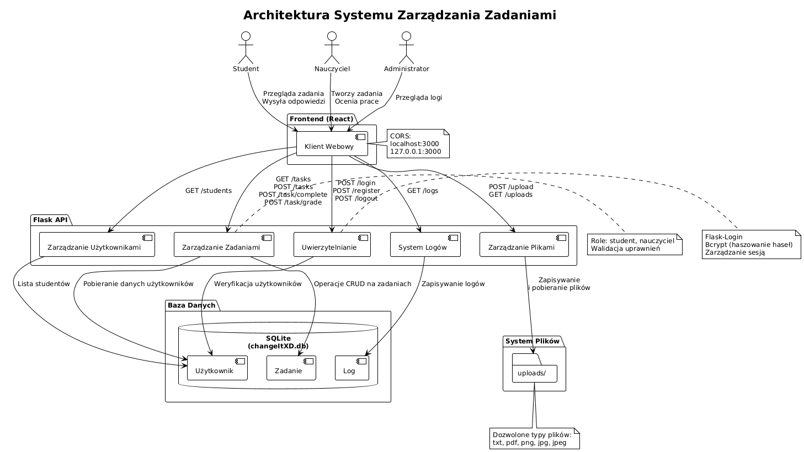

# Dokumentacja API

## Spis treści
- [Wprowadzenie](#wprowadzenie)
- [Konfiguracja i autoryzacja](#konfiguracja-i-autoryzacja)
- [Schematy danych](#schematy-danych)
- [Endpointy API](#endpointy-api)
- [Obsługa błędów](#obsługa-błędów)
- [Przykłady użycia](#przykłady-użycia)

## Diagram Architektury

---

## Wprowadzenie
System Zarządzania Zadaniami to aplikacja typu REST API oparta na Flask, która umożliwia zarządzanie zadaniami pomiędzy nauczycielami a uczniami. System oferuje funkcjonalności rejestracji i logowania użytkowników, tworzenia i zarządzania zadaniami, oceniania oraz przesyłania plików.

**Informacje techniczne:**
- URL bazowy: http://localhost:5000
- Architektura: REST API
- Format danych: JSON
- Baza danych: SQLite
- Autoryzacja: Flask-Login (sesyjne)

---

## Konfiguracja i autoryzacja
**CORS**  
API obsługuje Cross-Origin Resource Sharing (CORS) dla następujących origin:
- http://localhost:3000
- http://127.0.0.1:3000

**Mechanizm autoryzacji**  
System wykorzystuje autoryzację sesyjną z wykorzystaniem Flask-Login. Po pomyślnym logowaniu, użytkownik otrzymuje sesję, która jest wymagana do wykonywania operacji wymagających uwierzytelnienia.

**Role użytkowników:**
- **student** - może przeglądać przypisane zadania, oznaczać je jako ukończone, przesyłać pliki
- **teacher** - może tworzyć zadania, przeglądać wszystkie swoje zadania, oceniać prace uczniów
- **admin** - może przeglądać logi systemowe

---

## Schematy danych

### User (Użytkownik)
```json
{
  "id": "integer",
  "name": "string",
  "surname": "string", 
  "email": "string",
  "password": "string (hashed)",
  "role": "string [student|teacher|admin]"
}
```

### Task (Zadanie)
```json
{
  "id": "integer",
  "content": "string",
  "student_id": "integer",
  "teacher_id": "integer", 
  "completed": "boolean",
  "due_date": "datetime",
  "sent_date": "datetime",
  "answer": "string",
  "max_points": "integer",
  "grade": "integer",
  "comment": "string",
  "file_path": "string"
}
```

### Log (Dziennik)
```json
{
  "id": "integer",
  "user_id": "integer",
  "action": "string",
  "timestamp": "datetime"
}
```

---

## Endpointy API

### Autoryzacja i uwierzytelnianie

#### `POST /register`
Rejestracja nowego użytkownika w systemie.

**Parametry żądania:**
```json
{
  "name": "string (wymagane)",
  "surname": "string (wymagane)", 
  "email": "string (wymagane, unique)",
  "password": "string (wymagane)",
  "role": "string (wymagane) [student|teacher|admin]"
}
```

**Przykład żądania:**
```json
{
  "name": "Jan",
  "surname": "Kowalski",
  "email": "jan.kowalski@example.com",
  "password": "bezpieczneHaslo123",
  "role": "student"
}
```

**Odpowiedź sukcesu (201):**
```json
{
  "message": "User registered successfully"
}
```

**Możliwe błędy:**
- 400 - Email już istnieje w systemie

---

#### `POST /login`
Logowanie użytkownika do systemu.

**Parametry żądania:**
```json
{
  "email": "string (wymagane)",
  "password": "string (wymagane)"
}
```

**Odpowiedź sukcesu (200):**
```json
{
  "message": "Login successful",
  "user": {
    "id": 1,
    "name": "Jan",
    "role": "student"
  }
}
```

**Możliwe błędy:**
- 401 - Nieprawidłowe dane logowania

---

#### `POST /logout`
Wylogowanie użytkownika z systemu.

**Odpowiedź sukcesu (200):**
```json
{
  "message": "Logout successful"
}
```

---

### Zarządzanie zadaniami

#### `GET /tasks`
Pobieranie listy zadań dla konkretnego użytkownika.

**Parametry zapytania:**
- `user_id` (wymagany)
- `role` (wymagany) `[student|teacher]`

**Odpowiedź dla ucznia:**
```json
[
  {
    "id": 1,
    "content": "Rozwiąż równania kwadratowe",
    "due_date": "2025-12-31",
    "answer": "Odpowiedź ucznia",
    "completed": true,
    "max_points": 10,
    "grade": 8,
    "file_path": "uploads/task_1_file.pdf",
    "teacher_name": "Anna Nowak"
  }
]
```

**Odpowiedź dla nauczyciela:**
```json
[
  {
    "id": 1,
    "content": "Rozwiąż równania kwadratowe", 
    "due_date": "2025-12-31",
    "answer": "Odpowiedź ucznia",
    "completed": true,
    "max_points": 10,
    "grade": 8,
    "file_path": "uploads/task_1_file.pdf",
    "student_name": "Jan Kowalski"
  }
]
```

**Możliwe błędy:**
- 400 - Brak wymaganych parametrów
- 400 - Nieprawidłowa rola

---

#### `POST /tasks`
Tworzenie nowego zadania (tylko dla nauczycieli).

**Parametry żądania:**
```json
{
  "content": "string (wymagane)",
  "student_id": "integer (wymagane)",
  "teacher_id": "integer (wymagane)",
  "due_date": "string YYYY-MM-DD (wymagane)",
  "max_points": "integer (wymagane)"
}
```

**Odpowiedź sukcesu (201):**
```json
{
  "message": "Task created successfully"
}
```

**Możliwe błędy:**
- 400 - Brak teacher_id
- 404 - Nauczyciel lub uczeń nie został znaleziony

---

#### `GET /task/{task_id}`
Pobieranie szczegółów zadania.

**Odpowiedź:**
```json
{
  "id": 1,
  "content": "Napisz esej na temat zmian klimatycznych",
  "student_id": 1,
  "teacher_id": 2,
  "due_date": "2025-01-15",
  "sent_date": "2025-01-10 14:30:00",
  "answer": "Kompletny esej ucznia...",
  "completed": true,
  "max_points": 15,
  "grade": 12,
  "comment": "Bardzo dobra praca!",
  "file_path": "uploads/1_1_essay.pdf",
  "student_name": "Jan Kowalski",
  "teacher_name": "Anna Nowak"
}
```

**Możliwe błędy:**
- 400 / 403 / 404

---

#### `POST /task/complete/{task_id}`
Uczeń oznacza zadanie jako ukończone.

**Parametry:**
```json
{
  "student_id": 1,
  "answer": "To jest moja odpowiedź na zadanie. Szczegółowe rozwiązanie problemu..."
}
```

**Odpowiedź:**
```json
{
  "message": "Task marked as completed"
}
```

---

#### `POST /task/grade/{task_id}`
Nauczyciel wystawia ocenę.

**Parametry:**
```json
{
  "teacher_id": 2,
  "grade": 12,
  "comment": "Bardzo dobra praca! Widać głębokie zrozumienie tematu."
}
```

**Odpowiedź:**
```json
{
  "message": "Task graded successfully"
}
```

---

### Zarządzanie użytkownikami

#### `GET /students`
```json
[
  { "id": 1, "name": "Jan Kowalski" },
  { "id": 3, "name": "Maria Wiśniewska" }
]
```

---

### Zarządzanie plikami

#### `POST /upload/{task_id}`

Parametry formularza:
- file (plik)
- student_id

**Odpowiedź:**
```json
{
  "message": "File uploaded",
  "filename": "1_1_document.pdf"
}
```

---

#### `GET /uploads/{filepath}`
Plik zostanie zwrócony jako załącznik.

---

### Logi systemowe

#### `GET /logs`
Dostępne tylko dla administratorów.

```json
[
  {
    "id": 1,
    "user": "Jan Kowalski",
    "action": "Jan Kowalski, Logged in",
    "timestamp": "2025-06-03 10:30:00"
  },
  {
    "id": 2,
    "user": "Anna Nowak", 
    "action": "Anna Nowak, Registered",
    "timestamp": "2025-06-03 09:15:00"
  }
]
```

---

### Narzędzia deweloperskie

#### `POST /clear_db`
```json
{
  "message": "Database cleared successfully"
}
```

---

## Obsługa błędów

| Kod | Znaczenie               | Opis                                 |
|-----|--------------------------|--------------------------------------|
| 200 | OK                       | Żądanie wykonane pomyślnie           |
| 201 | Created                  | Zasób utworzony pomyślnie            |
| 400 | Bad Request              | Nieprawidłowe żądanie                |
| 401 | Unauthorized             | Nieprawidłowe dane uwierzytelniające |
| 403 | Forbidden                | Brak uprawnień                       |
| 404 | Not Found                | Zasób nie znaleziony                 |
| 500 | Internal Server Error    | Błąd serwera                         |

**Format błędu:**
```json
{
  "message": "Opis błędu"
}
```

---

## Przykłady użycia

### Scenariusz 1: Rejestracja i logowanie ucznia
```bash
curl -X POST http://localhost:5000/register \
  -H "Content-Type: application/json" \
  -d '{
    "name": "Jan",
    "surname": "Kowalski", 
    "email": "jan@example.com",
    "password": "haslo123",
    "role": "student"
  }'

curl -X POST http://localhost:5000/login \
  -H "Content-Type: application/json" \
  -d '{
    "email": "jan@example.com",
    "password": "haslo123"
  }'
```

### Scenariusz 2: Nauczyciel tworzy zadanie
```bash
curl -X POST http://localhost:5000/login \
  -H "Content-Type: application/json" \
  -d '{"email": "nauczyciel@example.com","password": "haslo123"}'

curl -X GET http://localhost:5000/students

curl -X POST http://localhost:5000/tasks \
  -H "Content-Type: application/json" \
  -d '{
    "content": "Rozwiąż zadania z matematyki ze strony 45",
    "student_id": 1,
    "teacher_id": 2,
    "due_date": "2025-07-01",
    "max_points": 20
  }'
```

### Scenariusz 3: Uczeń wykonuje zadanie
```bash
curl -X GET "http://localhost:5000/tasks?user_id=1&role=student"

curl -X POST http://localhost:5000/task/complete/1 \
  -H "Content-Type: application/json" \
  -d '{"student_id": 1,"answer": "Rozwiązania zadań: 1) x=5, 2) y=3, 3) z=7"}'

curl -X POST http://localhost:5000/upload/1 \
  -F "file=@rozwiazania.pdf" \
  -F "student_id=1"
```

### Scenariusz 4: Nauczyciel ocenia pracę
```bash
curl -X GET "http://localhost:5000/task/1?user_id=2&role=teacher"

curl -X GET http://localhost:5000/uploads/1_1_rozwiazania.pdf

curl -X POST http://localhost:5000/task/grade/1 \
  -H "Content-Type: application/json" \
  -d '{
    "teacher_id": 2,
    "grade": 18,
    "comment": "Bardzo dobre rozwiązania. Wszystkie odpowiedzi poprawne."
  }'
```

---

## Zabezpieczenia

**Walidacja:**
- Parametry wejściowe są walidowane
- Hasła hashowane przez bcrypt
- Bezpieczne nazwy plików `secure_filename()`

**Kontrola dostępu:**
- Role i uprawnienia na endpointach
- Ograniczony dostęp do logów i zadań

**Bezpieczeństwo plików:**
- Dozwolone rozszerzenia: `txt`, `pdf`, `png`, `jpg`, `jpeg`
- Przechowywanie w folderze `uploads/`

**Logowanie:**
- Rejestracja i logowanie użytkowników
- Wszystkie akcje są przypisane do użytkowników

---

**Ostatnia aktualizacja:** 3 czerwca 2025  
**Wersja API:** 1.0