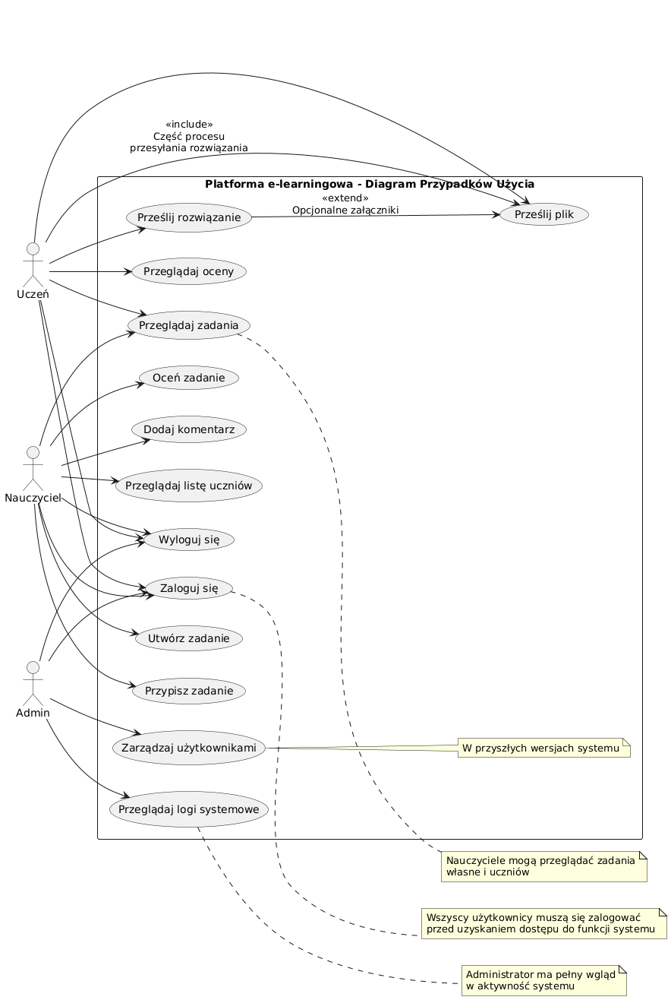
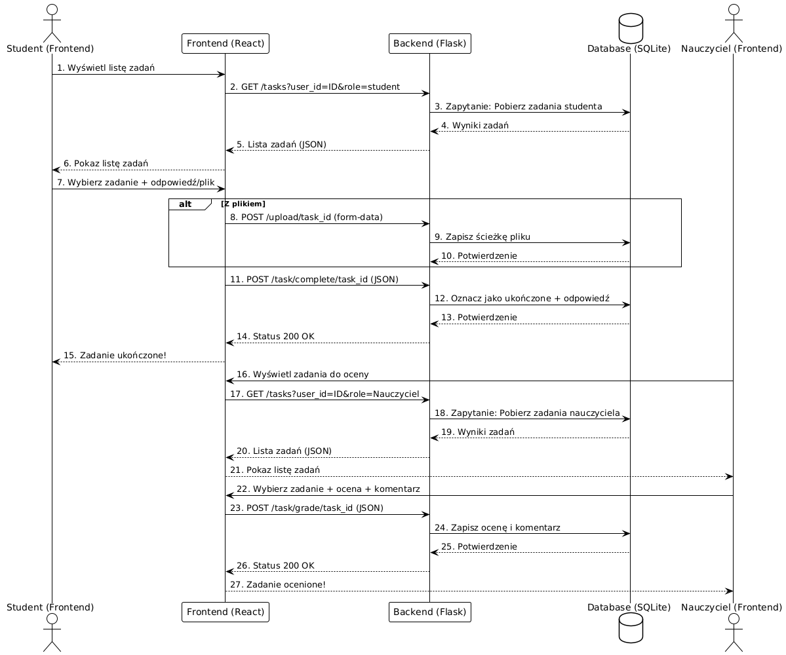
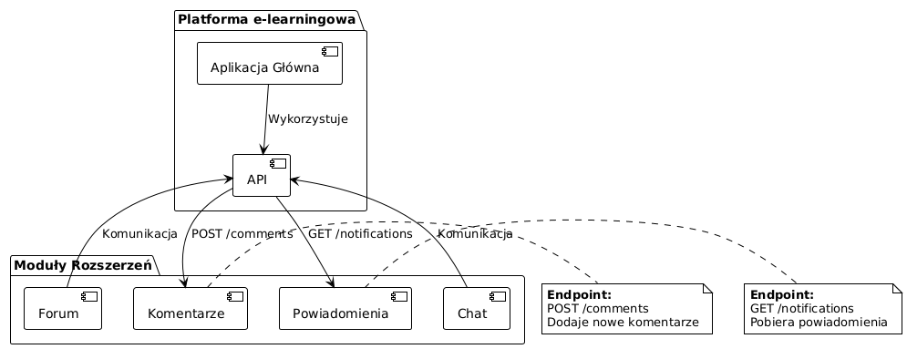

# Platforma e-learningowa – Dokumentacja Techniczna

## Spis treści

1. [Wprowadzenie](#1-wprowadzenie)  
2. [Analiza Technologii](#2-analiza-technologii)  
   - [Backend – Flask](#21-backend--flask)  
   - [Frontend – Next.js + React](#22-frontend--nextjs--react)  
   - [Komunikacja API](#23-komunikacja-api)  
3. [Architektura Systemu](#3-architektura-systemu)  
   - [Wzorzec Architektoniczny](#31-wzorzec-architektoniczny)  
   - [Komponenty Systemu](#32-komponenty-systemu)  
4. [Założenia Projektowe](#4-założenia-projektowe)  
   - [Diagram Przypadków Użycia](#41-diagram-przypadków-użycia)  
   - [Diagram Klas](#42-diagram-klas)  
   - [Role Użytkowników](#43-role-użytkowników)  
   - [Bezpieczeństwo](#44-bezpieczeństwo)  
5. [Komunikacja Między Komponentami](#5-komunikacja-między-komponentami)  
   - [API Endpoints](#51-api-endpoints)  
   - [Diagram Sekwencji](#52-diagram-sekwencji)  
   - [Frontend-Backend Communication](#53-frontend-backend-communication)  
6. [Modele Danych](#6-modele-danych)  
   - [User Model](#61-user-model)  
   - [Task Model](#62-task-model)  
   - [Log Model](#63-log-model)  
   - [Diagram ERD](#64-diagram-erd)  
7. [Bezpieczeństwo Systemu](#7-bezpieczeństwo-systemu)  
   - [Uwierzytelnianie i Autoryzacja](#71-uwierzytelnianie-i-autoryzacja)  
   - [Walidacja Danych](#72-walidacja-danych)  
   - [Polityka CORS](#73-polityka-cors)  
8. [Skalowalność i Wydajność](#8-skalowalność-i-wydajność)  
   - [Aktualne Rozwiązania Skalowalności](#81-aktualne-rozwiązania-skalowalności)  
   - [Rekomendacje dla Zwiększenia Skalowalności](#82-rekomendacje-dla-zwiększenia-skalowalności)  
   - [Diagram Architektury Wdrożeniowej](#83-diagram-architektury-wdrożeniowej)  
9. [Integracja z Dodatkowymi Modułami](#9-integracja-z-dodatkowymi-modułami)  
   - [Możliwości Rozszerzenia](#91-możliwości-rozszerzenia)  
   - [Punkty Rozszerzeń API](#92-punkty-rozszerzeń-api)  
   - [Diagram Integracji](#93-diagram-integracji)  
10. [Monitoring i Obsługa Błędów](#10-monitoring-i-obsługa-błędów)  
    - [System Logowania](#101-system-logowania)  
    - [Rekomendowane Rozszerzenia Monitoringu](#102-rekomendowane-rozszerzenia-monitoringu)  
11. [Wdrożenie i DevOps](#11-wdrożenie-i-devops)  
    - [Obecna Konfiguracja Development](#111-obecna-konfiguracja-development)  
    - [Rekomendacje dla Wdrożenia Produkcyjnego](#112-rekomendacje-dla-wdrożenia-produkcyjnego)  
12. [Podsumowanie](#12-podsumowanie)  
    - [Mocne Strony Obecnej Architektury](#121-mocne-strony-obecnej-architektury)  
    - [Obszary do Poprawy](#122-obszary-do-poprawy)  
    - [Roadmapa Rozwoju](#123-roadmapa-rozwoju)

---

## 1. Wprowadzenie

### 1.1 Cel Dokumentu

Dokumentacja techniczna systemu **Platforma e-learningowa** – platformy e-learningowej służącej do zarządzania zadaniami edukacyjnymi. System został opracowany w ciągu ostatnich 3 miesięcy i jest gotowy do dalszego rozwoju i wdrożenia.

### 1.2 Zakres Systemu

**Platforma e-learningowa** umożliwia efektywne zarządzanie procesem edukacyjnym między nauczycielami a uczniami, zapewniając następujące funkcjonalności:

- Zarządzanie użytkownikami (nauczyciele, uczniowie, administratorzy)  
- Tworzenie i przypisywanie zadań z określonymi terminami wykonania  
- Przesyłanie odpowiedzi i plików przez uczniów  
- Ocenianie i komentowanie zadań przez nauczycieli  
- Monitoring aktywności systemu i logowanie zdarzeń  

## 2. Analiza Technologii

### 2.1 Backend – Flask

**Wykorzystane Technologie:**

- Flask (Python Web Framework)  
- SQLAlchemy – ORM  
- Flask-Login – uwierzytelnianie i sesje  
- Flask-Bcrypt – bezpieczne hasła  
- Flask-CORS – kontrola CORS  
- SQLite – baza danych  

**Uzasadnienie:**

- Elastyczność i szybkość rozwoju  
- Zaawansowana kontrola nad logiką aplikacji  
- Łatwa integracja z frontem  
- Wsparcie dla rozbudowy  

### 2.2 Frontend – Next.js + React

**Technologie:**

- Next.js (React + SSR/SSG)  
- React + Hooks  
- TypeScript  
- Custom hooks: `useApi`, `useAuth`  

**Korzyści:**

- Bezpieczny typowo kod  
- Komponentowa struktura  
- Reużywalna logika (hooks)  
- Optymalizacja SEO i wydajności (Next.js)  

### 2.3 Komunikacja API

**REST API:**

- Metody: GET, POST, PUT, DELETE  
- Dane: JSON  
- Uwierzytelnianie: sesje (cookies)  
- Parametryzacja: query strings  

## 3. Architektura Systemu

### 3.1 Wzorzec Architektoniczny

**Layered Architecture (N-tier):**

- **Presentation**: React Components  
- **Logic**: Custom Hooks  
- **Data Access**: Flask API  
- **Data**: SQLite  

### 3.2 Komponenty Systemu

**Backend:**

- AuthService  
- TaskService  
- FileUploadService  
- LoggingService  
- Modele: User, Task, Log  

**Frontend:**

- AuthContext  
- useApi  
- Dashboardy dla ról  
- Layout globalny  

## 4. Założenia Projektowe

### 4.1 Diagram Przypadków Użycia

### 4.2 Role Użytkowników

**Uczeń:**  
- Przeglądanie zadań, przesyłanie plików z wykonanym zadaniem, przeglądanie ocen zadań

**Nauczyciel:**  
- Tworzenie i ocenianie zadań  

**Administrator:**  
- Monitorowanie, zarządzanie użytkownikami  

### 4.3 Bezpieczeństwo

- bcrypt – hasła  
- Flask-Login – sesje  
- RBAC  
- Biała lista rozszerzeń  
- CORS  

## 5. Komunikacja Między Komponentami

### 5.1 API Endpoints

**Auth:**  
- `POST /login`  
- `POST /register`  
- `POST /logout`  

**Tasks:**  
- `GET /tasks`  
- `POST /tasks`  
- `GET /tasks/<id>`  
- `PUT /tasks/<id>`  
- `DELETE /tasks/<id>`  

**Files:**  
- `POST /upload`  
- `GET /download/<filename>`  

### 5.2 Diagram Sekwencji

### 5.3 Frontend-Backend Communication

- Hooki wykonujące fetch  
- Uwierzytelnianie via `credentials: include`  
- Obsługa błędów  

## 6. Modele Danych

### 6.1 User Model

- `id`, `username`, `password_hash`, `role`  

### 6.2 Task Model

- `id`, `title`, `description`, `due_date`, `teacher_id`, `student_id`, `status`, `grade`  

### 6.3 Log Model

- `id`, `user_id`, `action`, `timestamp`  

### 6.4 Diagram ERD

*Do dodania*  

## 7. Bezpieczeństwo Systemu

### 7.1 Uwierzytelnianie i Autoryzacja

- `@login_required`, `current_user`, `role`  
- Sesje trzymane w cookie  

### 7.2 Walidacja Danych

- Flask-WTF / manualna  
- Wymuszanie typów  

### 7.3 Polityka CORS

- Flask-CORS  
- Tylko wybrane domeny  

## 8. Skalowalność i Wydajność

### 8.1 Aktualne Rozwiązania Skalowalności

- Mała skala (SQLite, monolityczny Flask)  
- Brak konteneryzacji  

### 8.2 Rekomendacje dla Zwiększenia Skalowalności

- Docker + docker-compose  
- Gunicorn + Nginx  
- Redis (cache, sesje)  

## 9. Integracja z Dodatkowymi Modułami

### 9.1 Możliwości Rozszerzenia

- Forum  
- Komentarze  
- Powiadomienia  
- Chat  

### 9.2 Punkty Rozszerzeń API

- `POST /comments`
- `GET /notifications`

### 9.3 Diagram Integracji

## 10. Monitoring i Obsługa Błędów

### 10.1 System Logowania

- Logi zdarzeń z `Log` model  
- Widok admina  

### 10.2 Rekomendowane Rozszerzenia Monitoringu

- Sentry  
- Prometheus + Grafana  

## 11. Wdrożenie i DevOps

### 11.1 Obecna Konfiguracja Development

- Flask dev server  
- SQLite  
- Brak konteneryzacji  

### 11.2 Rekomendacje dla Wdrożenia Produkcyjnego

- Użycie Docker  
- Wydzielenie warstw (backend, frontend, DB)  
- Reverse proxy (Nginx)  
- Automatyczne testy + CI  

## 12. Podsumowanie

### 12.1 Mocne Strony Obecnej Architektury

- Czyste rozdzielenie warstw  
- Prosta rozbudowa  
- Łatwość uruchamiania  

### 12.2 Obszary do Poprawy

- Skalowalność  
- Obsługa błędów  

### 12.3 Roadmapa Rozwoju

1. Konteneryzacja (Docker)  
2. CI/CD (GitHub Actions)  
3. Moduł powiadomień  